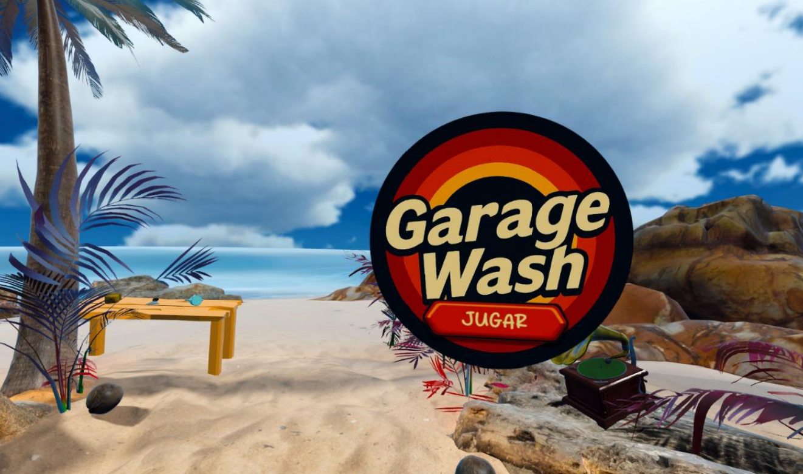
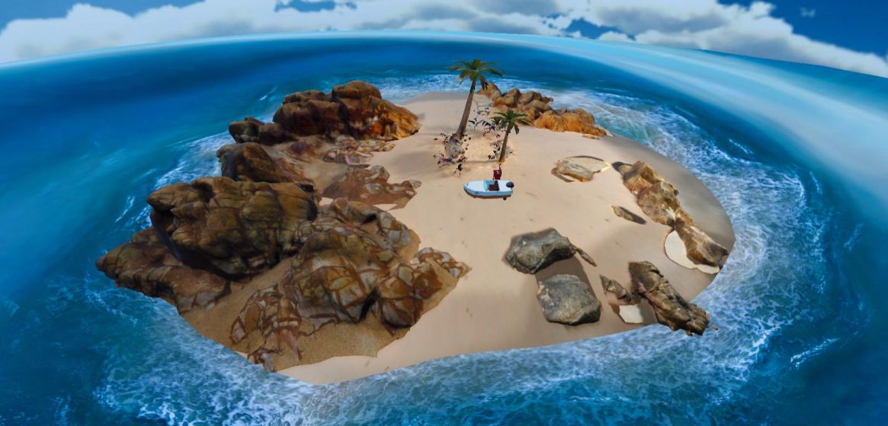
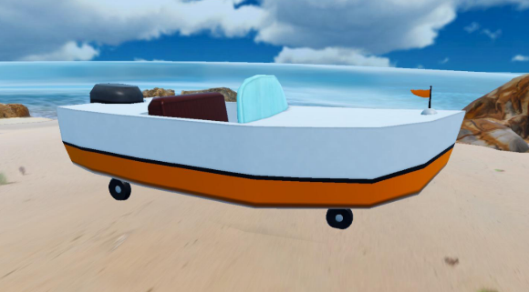
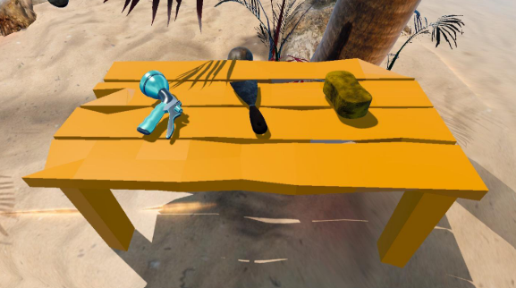

# Garage Wash



Simulación de limpieza de vehículos. Un coche-barco aparece varado en una isla desierta tras pasar mucho tiempo sumergido y hay que restaurarlo antes de que el mar acabe de arruinarlo. Dos proyectos Unity independientes: una versión VR completa (`GarageWash/`) y una versión AR para Android (`GarageWashMobile/`).

Proyecto académico de Grupo 6, asignatura de Entornos Interactivos Avanzados.

## Concepto

- **Género:** simulación interactiva de limpieza de vehículos.
- **Escenario:** isla desierta en mitad del mar, escala 1:1, iluminación natural y sonido envolvente.

<p align="center"></p>

- **Estética:** entorno semi-realista contrastado con un vehículo y herramientas de estilo cartoon/goofy (inspiración Bob Esponja), para que destaquen los elementos interactivos.
- **Referencias:** PowerWash Simulator, House Flipper y Car Mechanic Simulator (satisfacción del progreso visual); Job Simulator y Vacation Simulator (interacción física con herramientas); The Forest (UI de instrucciones tipo diario).

---

## Versión VR (`GarageWash/`)

PCVR / Quest Link. Juego completo con las tres herramientas.

<p align="center"></p>

**Movimiento:** teletransporte por puntos válidos del suelo + rotación suave o instantánea por joystick.

**Herramientas** (agarre físico por `Grip`, XR Interaction Toolkit):

- **Espátula** (`Espatula.cs` / `SimpleScraper`): retira percebes (`ScrapableObject.cs` / `SimpleBarnacle`). Detecta el contacto con una esfera física y valida el ángulo de la hoja contra la normal de la superficie, admitiendo las dos caras. Si el ángulo no es correcto no rasca. Cada percebe acumula tiempo de rascado y lo pierde si se deja a medias; al completarse sale disparado con impulso y torque, con vibración progresiva en el mando.
- **Esponja** (`SpongeController.cs` / `MagneticSponge`): se imanta al casco cuando está cerca (`OverlapSphere` y suavizado), así el frotado va pegado a la superficie en vez de flotar.
- **Manguera** (`PowerWashController.cs` y `WaterProjectile.cs`): dispara proyectiles de agua con balística real (velocidad, gravedad, dispersión cónica) por Input System (`<XRController>/trigger`). El joystick controla el foco del chorro interpolando ángulo del cono, radio e intensidad.

<p align="center"></p>

**Tecnología:** Unity 6000.2.10f1, URP 17.2.0, XR Interaction Toolkit 3.3.0, OpenXR 1.15.1, XR Hands 1.7.0, Input System 1.14.2 con los bindings de `XRController` hechos por código.

Vídeo teaser, de la escena `Teaser.unity`: [`pictures/taser.mp4`](pictures/taser.mp4).

## Versión AR Android (`GarageWashMobile/`)

App de móvil con Vuforia Engine. No usa marcadores de imagen sino Ground Plane, detección del suelo. Trae una sola herramienta, la manguera, y funciona como demo guiada.

**Colocación** (`PlacementController.cs`):
1. `PlaneFinderBehaviour` de Vuforia busca el suelo apuntando con la cámara. Con el plano detectado aparece un modelo fantasma del coche-barco.
2. Con dos dedos: pellizcar escala, girar rota (`HandleMobileGestures`, con Enhanced Touch).
3. Doble toque coloca el objeto definitivo, `AnchorBehaviour` lo ancla al mundo y arranca la partida.

**Lavado** (`PowerWashController.cs`, distinto al de la versión VR): mantener pulsada la pantalla activa el chorro y deslizar arriba y abajo cambia el foco. El punto de impacto no es un proyectil físico. La manguera sigue una curva Catmull-Rom definida por puntos de control en el editor y cada frame se lanza un `Physics.Linecast` sobre esa curva para saber dónde golpea el chorro. Un periodo de gracia evita que la limpieza se corte al empezar o al cambiar de zona, y `AreParticlesHittingNearby` exige que haya partículas cerca del punto para que no se limpie donde el agua no está llegando.

**Tutorial guiado** (`TutorialManager.cs` y `TutorialEvents.cs`): máquina de estados por eventos con 5 pasos (buscar superficie, escalar y rotar, doble toque, mantener pulsado para lavar, completado) que muestra y oculta paneles de instrucciones con fade. Si se salta un paso, por ejemplo colocando el objeto sin usar los gestos, lo detecta y avanza igual.

**Tecnología:** Unity 6000.2.10f1, URP 17.2.0, Vuforia Engine 11.4.4 (Ground Plane), Input System con Enhanced Touch, KBCore/Refs para validar referencias de escena en el inspector.

`GarageWashMobile.pdf` (Sprint 2A) describe una versión anterior basada en marcadores de imagen, con una tarjeta física para hacer aparecer el coche y otra para reproducir el teaser. El código final no usa esa vía, pasó a Ground Plane, así que ese PDF recoge el concepto original y no el comportamiento final.

## Suciedad y progreso (compartido)

`PaintableSurface.cs`, con pequeñas diferencias entre versiones. Cada superficie lavable lleva una máscara de suciedad en una `RenderTexture` que se pinta en tiempo real con cada colisión de partículas de agua o contacto de herramienta, interpolando entre frames para no dejar huecos si el movimiento es rápido. El progreso se mide con un compute shader de reducción paralela en GPU (PC y editor) o muestreando la textura a baja resolución en el resto de plataformas. Al superar el umbral de victoria la superficie se fuerza a limpio del todo. La partida va cronometrada y se pierde si se agota el tiempo (`GameManager.cs`).

En la versión VR el coche pasa por tres etapas (sucio con corales, sucio con barro, limpio) según se usa espátula, esponja y manguera. En la versión móvil, al haber una sola herramienta, es un único paso de limpiado.

## Estructura

```
GarageWash/                          # proyecto Unity, versión VR
  Assets/Scripts/
  Assets/Scenes/GarageWash.unity     # escena principal jugable
  Assets/Scenes/Teaser.unity         # escena del vídeo teaser
  Assets/XR/ XRI/ VRTemplateAssets/  # setup de interacción XR
  Packages/manifest.json
  GarageWash.exe                     # build de escritorio
  GarageWash.apk                     # build Meta Quest standalone

GarageWashMobile/                    # proyecto Unity, versión AR Android
  Assets/Scripts/
  Assets/Scenes/MenuPrincipal.unity
  Assets/Scenes/SampleScene.unity    # escena de la experiencia AR
  Assets/Resources/VuforiaConfiguration.asset
  Packages/manifest.json
  GarageWash.apk                     # build Android AR

GDD.pdf                 # diseño de la versión VR (Sprint 3A)
GarageWashMobile.pdf    # diseño original de la versión AR (Sprint 2A)
pictures/               # capturas y teaser
```

**Scripts de la versión VR (`GarageWash/Assets/Scripts`):**

| Script | Rol |
|---|---|
| `GameManager.cs` | temporizador de partida, victoria/derrota, cambio de escena |
| `PaintableSurface.cs` | máscara de suciedad, pintado por partículas, medición de progreso (GPU/CPU) |
| `PowerWashController.cs` / `WaterProjectile.cs` | manguera: balística real del chorro, foco por joystick |
| `Espatula.cs` (`SimpleScraper`) | rascado con validación de ángulo y háptica |
| `ScrapableObject.cs` (`SimpleBarnacle`) | percebes desprendibles con física |
| `SpongeController.cs` (`MagneticSponge`) | esponja con snapping magnético al casco |
| `AudioManager.cs` | sonidos one-shot y loops |
| `CleanProgressUI.cs` | HUD de progreso de limpieza |
| `HandMenu.cs` | menú de muñeca (botón primario del mando izquierdo) |
| `MainMenu.cs` / `PauseMenu.cs` | menús de inicio y pausa |
| `Instructions.cs` (`ObjetoInfoFijo`) | panel de información al coger un objeto |
| `VynilPlayer.cs` (`InteractableToggle`) | prop interactivo con animación + audio retardado |

**Scripts de la versión AR Android (`GarageWashMobile/Assets/Scripts`):**

| Script | Rol |
|---|---|
| `GameManager.cs` | temporizador, victoria/derrota (versión propia) |
| `PaintableSurface.cs` | máscara de suciedad (variante para un solo tipo de suciedad) |
| `PlacementController.cs` | Ground Plane de Vuforia, preview, gestos de escala/rotación, colocación por doble toque |
| `PowerWashController.cs` | manguera vía curva Catmull-Rom + `Physics.Linecast`, control táctil (mantener pulsado + deslizar) |
| `TutorialManager.cs` / `TutorialEvents.cs` | tutorial guiado por eventos, 5 pasos con fade |
| `AudioManager.cs` | sonidos one-shot y loops |
| `CleanProgressUI.cs` | HUD de progreso de limpieza |
| `MainMenu.cs` / `PauseMenu.cs` / `LoseMenu.cs` / `VictoryMenu.cs` | menús de inicio, pausa, derrota y victoria |

## Cómo abrirlo

Cada versión es un proyecto Unity independiente con su propio `Packages/manifest.json`, así que hay que abrirlos por separado en Unity Hub. Ambos piden Unity 6000.2.10f1 o superior de la serie 6.

**VR (`GarageWash/`):**
1. Añadir la carpeta `GarageWash/` como proyecto en Unity Hub.
2. Abrir `Assets/Scenes/GarageWash.unity`.
3. Para probarlo: SteamVR con enlace de escritorio, o Quest Link. Builds ya compilados: `GarageWash.exe` para escritorio y `GarageWash.apk` para Meta Quest standalone.

**AR Android (`GarageWashMobile/`):**
1. Añadir la carpeta `GarageWashMobile/` como proyecto en Unity Hub.
2. Hace falta una licencia de Vuforia Engine configurada en `Assets/Resources/VuforiaConfiguration.asset` para compilar y ejecutar.
3. Abrir `Assets/Scenes/SampleScene.unity`, o `MenuPrincipal.unity` para el menú.
4. Build ya compilado: `GarageWash.apk`. Se instala en un móvil Android y no necesita marcador impreso, basta apuntar a una superficie plana.

## Estado

Proyecto terminado. Las dos versiones están completas y son las entregadas como versión final del curso.
